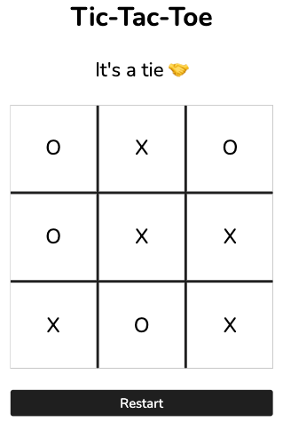

# tic-tac-toe

Live preview: https://taewookim02.github.io/tic-tac-toe/

This is a simple tic-tac-toe game created using HTML, CSS, and JavaScript. You can play the game by clicking on the cells of the game board to place your marks and try to get three in a row.

## Implementation

Designed to have as little global code as possible, with most of the functionality tucked away inside of a <strong>module</strong> or <strong>factory</strong>.

## Future Improvements

- Implement AI opponent
- Add scoring system
- Allow users to choose their markers
- Improve the visual design of the UI

## Technologies Used

- HTML
- CSS
- JavaScript
